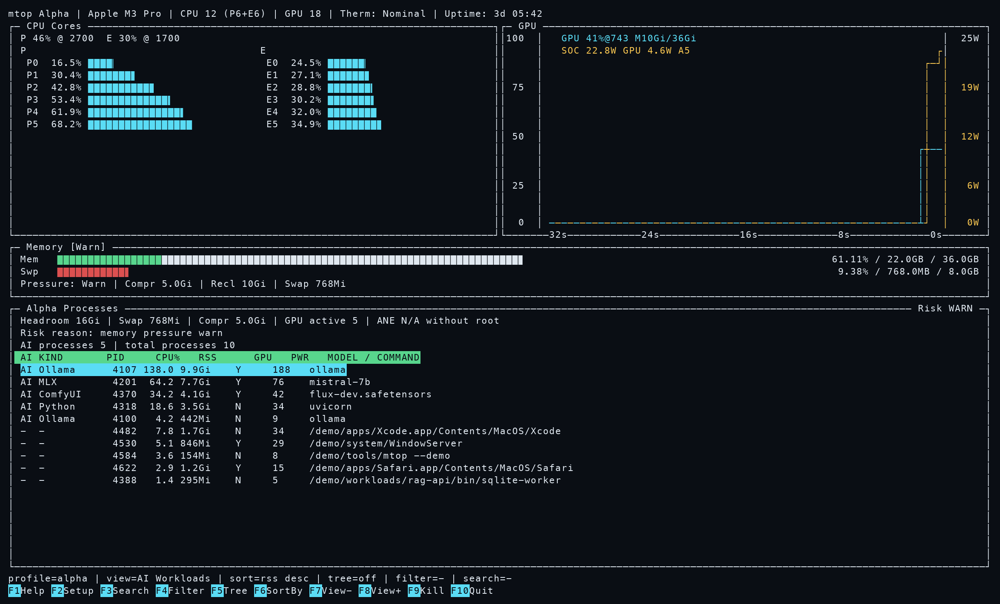
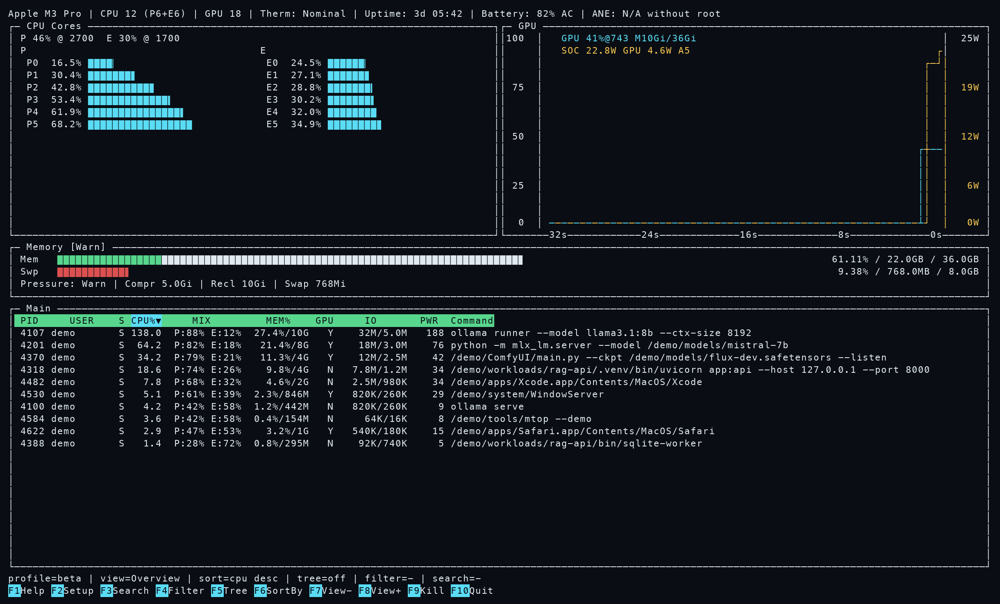

# mtop

[English](../README.md) | [简体中文](./README.zh-CN.md)

`mtop` 是一个面向 Apple Silicon Mac 的终端监控工具。

它希望让熟悉 `htop` 和 `nvtop` 的用户上手时没有门槛，但它的设计重点放在 macOS 和 M 系列 SoC 的真实特点上：统一内存、异构核心、GPU 活动、以及对本地 AI 工作负载有意义的功耗信息。

## 快速开始

直接通过 Homebrew tap 安装：

```bash
brew install lxrzlyr/mtop/mtop
```

或者先 tap 一次，再使用短名字：

```bash
brew tap lxrzlyr/mtop
brew install mtop
```

运行：

```bash
mtop
```

`mtop` 默认进入 AI-first alpha profile。切换到 classic monitor profile：

```bash
mtop -view beta
```

预览模式：

```bash
mtop --demo
mtop --demo -view beta
```

机器可读 snapshot：

```bash
mtop --snapshot json
mtop --snapshot json --count 10 --interval-ms 1000
mtop --snapshot json --session --output run.jsonl --count 10
```

## 截图

Alpha profile：



Beta profile：



## 为什么要做这个工具

因为直到今天，macOS 上依然没有一个真正让人称手、又足够理解 Apple Silicon 的终端监控工具。

过去监控 Mac 的资源使用情况，尤其对个人用户来说，似乎没有那么重要。AI 时代来临之后，这件事变了。越来越多的人开始在本地跑推理、编译更重的栈、调模型、压测统一内存、观察机器到底把算力和功耗花在了哪里。

我们希望能为每个用户都提供一把顺手的工具。

`mtop` 想解决的是：

- 让 Apple Silicon 的核心类型不再被当成“普通 CPU”糊弄过去
- 不用 `sudo` 也能拿到足够有用的信息
- 需要更深指标时，再让 root 模式补充增强
- 把性能、内存压力、GPU 活动和进程行为用一个舒服的 TUI 展示出来

## mtop 是什么

`mtop` 是：

- 一个 macOS-first 的 Apple Silicon 终端监控工具
- 一个针对 M 系列 SoC 优化的 TUI
- 在进程交互逻辑上参考了 `htop`
- 在 GPU 图形展示上参考了 `nvtop`
- 使用 C++20 与 ncurses 从头实现

## 它能显示什么

普通权限下：

- SoC 型号与 Apple Silicon 核心拓扑
- 按核心类别分组的 CPU 利用率
- `S / P / E` cluster 级 CPU 利用率摘要
- 统一内存、swap 使用情况，以及派生出的内存压力状态
- 支持排序、过滤、树形、搜索、选择、nice、signal 的进程主表
- 带增强摘要信息的 GPU 利用率面板
- 二级 `System I/O` 视图中的系统级 block storage、VM paging 与网络吞吐
- 按 GPU-active 过滤的进程视图
- 电池、启动时长、系统负载

root 增强模式下：

- thermal pressure
- ANE 活动（当平台可见时）
- 来自 `powermetrics` 的估算 SoC 子系统功耗
- GPU 功率 / 频率增强信息
- 基于 `powermetrics` 推导的进程核心类别混合信息
- 基于 `powermetrics` 的进程 IO 与 Energy Impact 列

二级视图与详情交互：

- `System I/O`：主机级 block storage、VM paging 与网络吞吐
- `GPU Active`：只显示 GPU-active 进程的 focused 视图
- `Process Detail`：显示完整命令、pid/ppid、运行时、内存、mix/io/power 和 GPU 状态的弹窗

## 进程扩展列说明

在 root 模式下，进程表会尝试显示三列来自 `powermetrics` 的扩展信息：

- `MIX`：采样窗口内的核心类别混合估计，例如 `S:12% P:88%`
- `IO`：采样窗口内的进程 `Bytes Read / Bytes Written`，例如 `3.9K/7.8K`
- `PWR`：来自 `powermetrics` 的进程 Energy Impact

这些列都属于 best-effort 的采样窗口指标，阅读时需要注意：

- `0B/0B` 或 `0` 表示该指标可用，但本次采样值为零
- `n/a` 表示 root 采样已经成功，但 `powermetrics` 在本次采样里没有给这个进程提供可用值
- `wait` 表示 root 后台采样线程还没有产出第一帧结果
- `stale` 表示最新 root 采样失败，当前展示的是上一份成功的 root 样本
- `root` 表示这一列需要通过 `sudo ./build/mtop` 才能获得

## System I/O 语义

`System I/O` 视图会区分三类主机级信号：

- `Disk`：来自 IOKit block storage driver 的读 / 写字节计数
- `Paging`：来自 Mach VM counter 的 pageins / pageouts；这是内存分页活动，不等于磁盘吞吐
- `Net`：活跃非 loopback 网卡的收 / 发字节计数

如果某类 counter 不可用，mtop 会显示 `n/a`，不会把不可用误写成 0。

## 关于 `SOC` 功耗

GPU 面板中的 `SOC` 并不是充电功率，也不是整机墙上取电功率。

它是由 `powermetrics` 中 CPU、GPU、ANE 等字段组合出来的 **估算 SoC 子系统功耗**。在 macOS 上，这是当前比较实际、也比较稳定的一条实时功耗数据来源。

所以它的特点是：

- 有参考价值
- 是估算值
- 反映的是芯片子系统活动，不是电源适配器输入功率

## 当前功能

当前稳定版本：`v2.0.0`。

- Apple Silicon-aware CPU 面板
- CPU cluster 摘要行
- `htop` 风格的主进程表
- 增量搜索和过滤
- 树形模式与展开 / 折叠
- 键盘与鼠标排序
- 参考 `nvtop` 的 GPU 曲线面板
- 统一内存、swap 与 memory pressure 可视化
- 二级 `System I/O` / `GPU Active` 视图
- best-effort GPU、ANE、thermal、root process、disk、paging 与 network 指标的不可用原因
- 进程详情弹窗，并显示 root 增强指标的可用性原因
- 面向脚本和结构化采集的 JSON snapshot 输出
- 扩展配置项，支持默认视图、cached memory 展示、排序和 snapshot 间隔
- 默认非 root 模式
- root 增强采样路径
- demo 模式
- 用于终端兼容性排查的独立输入诊断工具
- `cpack` 打包发布

## 版本状态

`v2.0.0` 从同一份源码提供两个运行时 profile。默认的 `alpha` profile 是 AI-first，包含 workload 检测、memory risk 摘要、JSON v2 字段和 JSONL session。`beta` profile 保留 1.x 熟悉的 classic monitor UI。使用 `-view alpha` 或 `-view beta` 可以在运行时持久化切换。

## 构建

```bash
cmake -S . -B build
cmake --build build -j4
```

## 运行

普通模式：

```bash
./build/mtop
```

root 增强模式：

```bash
sudo ./build/mtop
```

安全提示：

- `sudo` 模式是可选增强功能，只建议在你信任的系统上使用
- 不要在已经被入侵、被破解、被篡改，或整体安全状态可疑的机器上以 root 方式运行 `mtop`
- root 模式会触发特权遥测采集，因此它的安全边界直接受宿主系统当前安全状态影响

UI 预览模式：

```bash
./build/mtop --demo
```

辅助脚本：

```bash
./scripts/preview_demo.sh
```

Snapshot 模式不会初始化 curses：

```bash
./build/mtop --snapshot json
./build/mtop --snapshot json --loop
./build/mtop --snapshot json --count 10 --interval-ms 1000
./build/mtop --demo --snapshot json
./build/mtop --demo --snapshot json --session --output /tmp/mtop-session.jsonl --count 3
```

每个 snapshot 都是完整 JSON 对象，包含 `schema_version: 2`、`view_profile`、时间戳/采样间隔、host 元数据、capability status、CPU、memory、GPU、ANE、I/O、process、`workloads` 和 `memory_risk` 字段。Session mode 写入 JSONL 事件：`session_start`、每个采样点一个 `snapshot`，以及 `session_end`。

## 操作说明

主界面交互：

- `Up / Down / PgUp / PgDn / Home / End`：移动选中
- `F3` 或 `/`：增量搜索
- `F4` 或 `\`：增量过滤
- `F5` 或 `t`：树形模式
- `+ / - / *`：展开 / 折叠 / 切换树节点
- `F6` 或 `>` 或 `.`：排序菜单
- `N / P / M / T / A / G / O / W / I`：PID / CPU / MEM / TIME / NAME / GPU-active / IO / PWR / 反转排序
- `F7 / F8`、`Tab / Shift-Tab` 或 `{ / }`：切换前后视图
- `] / [`：调整 nice
- `F9` 或 `k`：发送信号
- `d`：打开进程详情弹窗
- `F10` 或 `q`：退出
- 鼠标：点击表头排序，点击进程行选中，点击函数栏按钮触发动作

## 配置

可选配置文件路径：

```text
~/.config/mtop/config
```

示例文件：

```text
.config.example
```

支持的配置项：

```text
theme=apple
refresh_ms=1000
process_limit=12
demo_mode=false
root_sample_ms=1000
snapshot_interval_ms=1000
show_cached_memory=false
view_profile=alpha
default_view=overview
sort=cpu
sort_direction=desc
```

`view_profile` 选择产品视图 profile（`alpha` 或 `beta`）。缺失或无效值会回落到 alpha。`-view beta` / `--view beta` 和 `-view alpha` / `--view alpha` 会立即切换并持久化所选 profile。

CLI 覆盖：

```bash
./build/mtop --demo
./build/mtop -view beta
./build/mtop --refresh-ms 500
./build/mtop --theme mono
./build/mtop --config /path/to/config
./build/mtop --snapshot json --interval-ms 500
./build/mtop --debug-input
./build/mtop --debug-input --debug-log /tmp/mtop-input.log
```

## 安装与打包

本地安装：

```bash
cmake --install build --prefix /usr/local
```

本地打包：

```bash
./scripts/release.sh
```

如果你通过 Homebrew 安装，可以使用：

```bash
brew install lxrzlyr/mtop/mtop
```

## 致谢

`mtop` 从许多优秀工具身上学到了很多。

特别感谢：

- [`htop`](https://github.com/htop-dev/htop) 提供的进程交互思路、控制逻辑、内存展示方式，以及多年积累的优秀 TUI 设计
- [`nvtop`](https://github.com/Syllo/nvtop) 提供的 GPU 图形展示思路和曲线行为参考

它们对这个项目帮助很大。

## License

`mtop` 使用 GNU GPL v3.0 或更高版本。

详见 [LICENSE](./LICENSE)。
